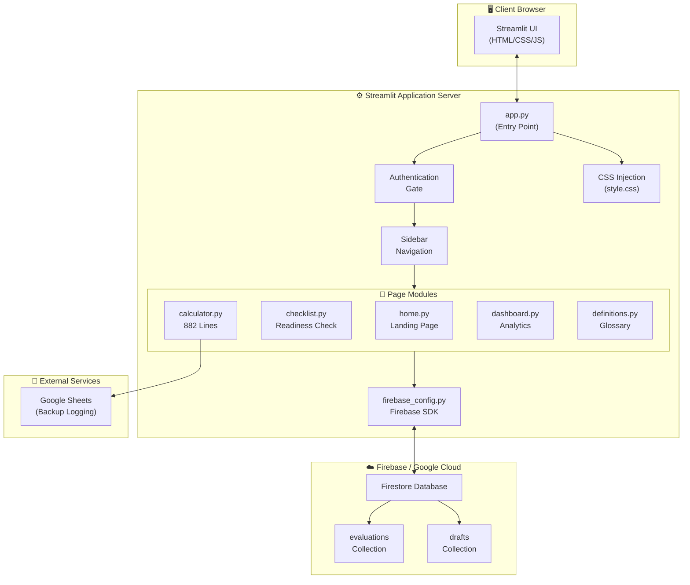
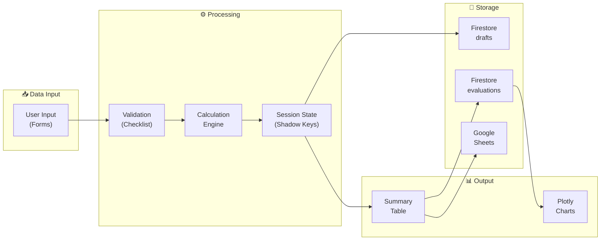
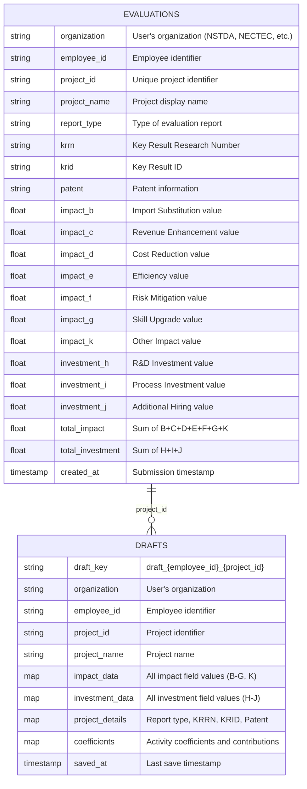
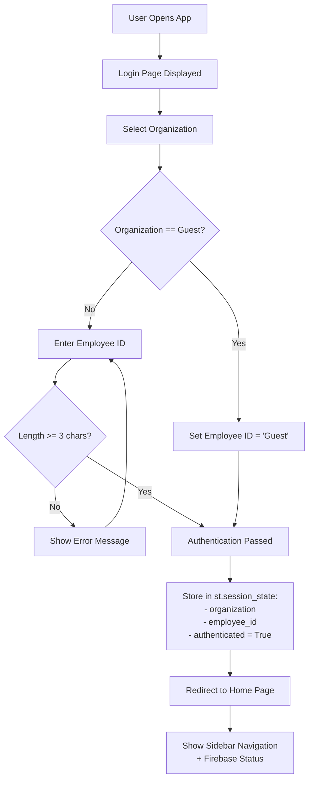
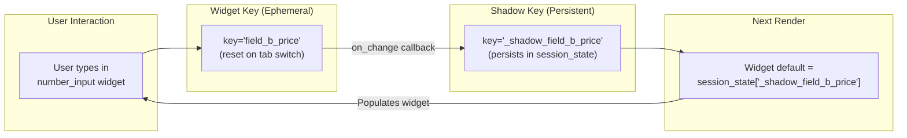
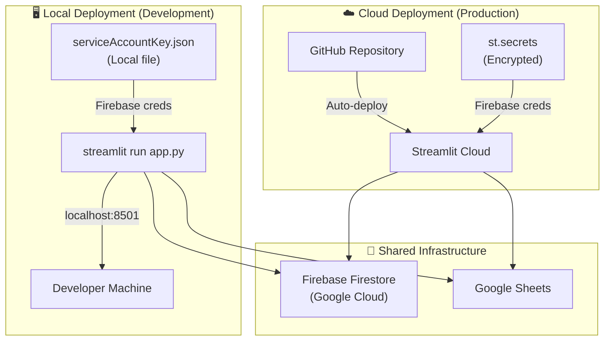

# Technical Report — Impact & Investment Evaluation System

> **Version:** 1.0  
> **Date:** May 2026  
> **Classification:** Internal Technical Documentation  
> **Author:** NSTDA / NECTEC Development Team  

---

## Table of Contents

- [1. Executive Summary](#1-executive-summary)
- [2. System Architecture](#2-system-architecture)
- [3. Technology Stack](#3-technology-stack)
- [4. File Structure](#4-file-structure)
- [5. Database Schema](#5-database-schema)
- [6. Authentication Flow](#6-authentication-flow)
- [7. State Management — Persistent Shadow Keys](#7-state-management--persistent-shadow-keys)
- [8. Calculation Engine](#8-calculation-engine)
- [9. API Integrations](#9-api-integrations)
- [10. Security Considerations](#10-security-considerations)
- [11. Performance Optimizations](#11-performance-optimizations)
- [12. Deployment Architecture](#12-deployment-architecture)
- [13. Known Limitations](#13-known-limitations)
- [14. Future Enhancements](#14-future-enhancements)
- [15. References](#15-references)

---

## 1. Executive Summary

The **Impact & Investment Evaluation System** is a web-based application developed for the **National Science and Technology Development Agency (NSTDA)** of Thailand. It enables researchers across NSTDA's national centers (NECTEC, BIOTEC, MTEC, NANOTEC, ENTEC) to quantitatively evaluate the **Pre-Impact** and **Pre-Investment** values of Research & Development (R&D) projects.

### Key Objectives

- **Standardize** the evaluation process for R&D project impact assessment
- **Quantify** expected economic impact across 7 impact categories (B–G, K) and 3 investment categories (H–J)
- **Centralize** data storage using Firebase Firestore for cloud-based persistence
- **Visualize** aggregated results through an interactive analytics dashboard
- **Streamline** workflows with cloud-based draft management and checklist validation

### System Highlights

| Aspect | Detail |
|--------|--------|
| **Framework** | Streamlit (Python) |
| **Database** | Firebase Firestore (NoSQL) |
| **Visualization** | Plotly (interactive charts) |
| **Authentication** | Session-based (Organization + Employee ID) |
| **State Sync** | Real-time Autosave + JS Autofill Click-Trap |
| **Theme** | Premium dark space with glassmorphism |
| **Languages** | Thai (primary) + English (technical terms) |
| **Calculator Size** | ~850 lines (calculator.py) |

---

## 2. System Architecture

### High-Level Architecture



### Data Flow Architecture



---

## 3. Technology Stack

### Core Technologies

| Technology | Version | Purpose |
|-----------|---------|---------|
| **Python** | 3.9+ | Runtime language |
| **Streamlit** | ≥ 1.35.0 | Web application framework |
| **Firebase Admin SDK** | ≥ 6.5.0 | Backend-as-a-Service (Firestore) |
| **Pandas** | ≥ 2.0.0 | Data manipulation and analysis |
| **Plotly** | ≥ 5.15.0 | Interactive data visualization |

### Frontend Technologies

| Technology | Usage |
|-----------|-------|
| **HTML5 / CSS3** | Streamlit's rendering engine + custom CSS injection |
| **Google Fonts** | Plus Jakarta Sans (Latin), Noto Sans Thai (Thai) |
| **Glassmorphism** | Frosted-glass UI effects via `backdrop-filter` |
| **CSS Variables** | Theme-consistent color tokens and spacing |

### Infrastructure

| Service | Usage |
|---------|-------|
| **Streamlit Cloud** | Production hosting |
| **Firebase Firestore** | Cloud NoSQL database |
| **Google Sheets API** | Backup data logging |
| **GitHub** | Source code repository (public) |
| **GitLab (NSTDA)** | Internal source code mirror |

---

## 4. File Structure

```
ImpactCalculator/
├── app.py                      # Main entry point, auth gate, sidebar nav, CSS injection
├── firebase_config.py          # Firebase Admin SDK initialization, CRUD operations
├── requirements.txt            # Python dependencies
├── .streamlit/
│   └── config.toml             # Streamlit theme configuration (dark mode)
├── css/
│   └── style.css               # Premium dark space theme, glassmorphism, fonts
├── pages/
│   ├── home.py                 # Landing page with feature cards and live stats
│   ├── checklist.py            # 2-section readiness assessment
│   ├── calculator.py           # Main calculator engine (882 lines, 4 tabs)
│   ├── dashboard.py            # Analytics with Plotly charts
│   └── definitions.py          # Glossary and reference material
├── docs/
│   ├── USER_MANUAL.md          # User manual (Thai + English)
│   ├── TECHNICAL_REPORT.md     # This document
│   └── DEPLOYMENT_GUIDE.md     # Deployment instructions
└── README.md                   # Project overview and quick start
```

### File Descriptions

| File | Lines (approx.) | Description |
|------|-----------------|-------------|
| `app.py` | ~150 | Entry point. Handles authentication gate (organization + employee ID), sidebar navigation, CSS injection from `css/style.css`, and Firebase connection status indicator. |
| `firebase_config.py` | ~120 | Firebase Admin SDK initialization with dual-mode support (Streamlit Secrets for cloud, local JSON fallback). Exports: `save_draft()`, `load_drafts()`, `delete_draft()`, `submit_evaluation()`, `get_dashboard_stats()`. |
| `requirements.txt` | 4 | Pinned minimum versions of core dependencies. |
| `.streamlit/config.toml` | ~15 | Dark theme: `primaryColor=#6366f1`, `backgroundColor=#090d16`, `secondaryBackgroundColor=#111827`, `textColor=#e5e7eb`. |
| `css/style.css` | ~300 | Premium dark space theme. Features: glassmorphism cards (`backdrop-filter: blur`), gradient buttons, animated hover effects, Google Fonts import (`Plus Jakarta Sans`, `Noto Sans Thai`), responsive layout adjustments. |
| `pages/home.py` | ~100 | Landing page. Displays 3 feature cards (Checklist, Calculator, Dashboard) with navigation. Pulls live stats from Firebase via `get_dashboard_stats()`. |
| `pages/checklist.py` | ~80 | Two-section readiness checklist. Section 1: Basic Criteria (external beneficiary, ≥1yr usage). Section 2: Project Characteristics (prototype, app, training, etc.). Both sections must pass to unlock calculator. |
| `pages/calculator.py` | 882 | Core calculator with 4 tabs. Implements 10 evaluation formulas (B–K), exclusivity rules, activity coefficients, draft management, and submission to Firestore + Google Sheets. Uses Persistent Shadow Keys pattern. |
| `pages/dashboard.py` | ~200 | Analytics dashboard. Plotly charts: pie chart by org, bar chart impact/investment, cumulative timeline. Searchable data table. Falls back to mock data when Firebase is unavailable. |
| `pages/definitions.py` | ~150 | Glossary/reference page. Expandable sections explaining each impact/investment category, coefficient definitions, formulas, and contact information. |

---

## 5. Database Schema

### Firestore Database Structure



### Collection: `evaluations`

Stores finalized, submitted evaluation records.

| Field | Type | Required | Description |
|-------|------|----------|-------------|
| `organization` | `string` | ✅ | Submitter's organization code |
| `employee_id` | `string` | ✅ | Submitter's employee ID |
| `project_id` | `string` | ✅ | Unique project identifier |
| `project_name` | `string` | ✅ | Human-readable project name |
| `report_type` | `string` | ✅ | Evaluation report type |
| `krrn` | `string` | ❌ | Key Result Research Number |
| `krid` | `string` | ❌ | Key Result ID |
| `patent` | `string` | ❌ | Patent information |
| `impact_b` | `float` | ✅ | Import Substitution value (THB) |
| `impact_c` | `float` | ✅ | Revenue Enhancement value (THB) |
| `impact_d` | `float` | ✅ | Cost Reduction value (THB) |
| `impact_e` | `float` | ✅ | Efficiency value (THB) |
| `impact_f` | `float` | ✅ | Risk Mitigation value (THB) |
| `impact_g` | `float` | ✅ | Skill Upgrade value (THB) |
| `impact_k` | `float` | ✅ | Other Impact value (THB) |
| `investment_h` | `float` | ✅ | R&D Investment value (THB) |
| `investment_i` | `float` | ✅ | Process Investment value (THB) |
| `investment_j` | `float` | ✅ | Additional Hiring value (THB) |
| `total_impact` | `float` | ✅ | Sum of all impact values |
| `total_investment` | `float` | ✅ | Sum of all investment values |
| `created_at` | `timestamp` | ✅ | Server-generated timestamp |

### Collection: `drafts`

Stores work-in-progress evaluation data, keyed by `draft_{employee_id}_{project_id}`.

| Field | Type | Required | Description |
|-------|------|----------|-------------|
| `organization` | `string` | ✅ | User's organization |
| `employee_id` | `string` | ✅ | User's employee ID |
| `project_id` | `string` | ✅ | Project identifier |
| `project_name` | `string` | ❌ | Project name |
| `impact_data` | `map` | ✅ | All impact section raw field values |
| `investment_data` | `map` | ✅ | All investment section raw field values |
| `project_details` | `map` | ✅ | Report type, KRRN, KRID, Patent |
| `coefficients` | `map` | ✅ | Selected coefficients and contributions |
| `saved_at` | `timestamp` | ✅ | Last save timestamp |

---

## 6. Authentication Flow

### Flow Diagram



### Authentication Details

| Aspect | Implementation |
|--------|---------------|
| **Method** | Session-based (no persistent auth) |
| **Storage** | `st.session_state` (Python dictionary) |
| **Credentials** | Organization selection + Employee ID string |
| **Password** | Not required — ID-based identification only |
| **Session Duration** | Until browser tab is closed or page is fully refreshed |
| **Organizations** | NSTDA, NECTEC, BIOTEC, MTEC, NANOTEC, ENTEC, Guest |
| **Guest Mode** | No Employee ID required |
| **ID Validation** | Minimum 3 characters (except Guest) |

### Session State Keys

```python
st.session_state["authenticated"]  # bool: login status
st.session_state["organization"]   # str: selected org
st.session_state["employee_id"]    # str: entered ID
```

---

## 7. State Management — Persistent Shadow Keys

### The Problem

Streamlit re-runs the entire script on every user interaction (button click, input change, tab switch). This causes form inputs to reset to their default values when users switch between tabs in the calculator, leading to data loss.

### The Solution: Persistent Shadow Keys Pattern

The calculator implements a **Persistent Shadow Keys** pattern where each form input has a corresponding "shadow" key in `st.session_state` that persists the value across re-runs.

### How It Works



### Implementation Pattern

```python
# 1. Read value using helper that queries active widget state, falling back to shadow key
def _pv(key, default=0.0):
    w_key = f"val_{key}"
    p_key = f"_p_val_{key}"
    if w_key in st.session_state:
        st.session_state[p_key] = st.session_state[w_key]
        return st.session_state[w_key]
    p_val = st.session_state.get(p_key)
    if p_val is not None: return p_val
    return default

# 2. Render widget using shadow key fallback
value = st.number_input(
    label="Field Label",
    value=float(_pv(field_id, default_value)),
    key=f"val_{field_id}",
    on_change=sync_val,
    args=(field_id,)
)
```

### Top-Level Shadow Key Cloning Loop
At the very beginning of `pages/calculator.py`, before any widgets are rendered or deleted during a rerun:
```python
for _k, _v in list(st.session_state.items()):
    if _k.startswith("val_") or _k.startswith("chk_"):
        st.session_state[f"_p_{_k}"] = _v
    elif _k.startswith("wid_"):
        field_name = _k[4:]
        val = _v
        if field_name == "projectId" and isinstance(val, str):
            val = val.upper()
            st.session_state[_k] = val
        st.session_state[field_name] = val
```

### Benefits

- ✅ Values persist across tab switches
- ✅ Values persist across widget interactions within the same session
- ✅ No external storage needed for temporary state
- ✅ Compatible with Streamlit's reactive execution model

### Limitations

- ❌ Values are lost on full page refresh (F5) unless loaded from Cloud
- ❌ Increases memory usage (2× keys per field)

### 7.1 Real-time Cloud Autosave

The `on_change` callback pattern has been extended to perform **Real-time Autosave** to Firebase Firestore. Every time a user changes a field and clicks away, the shadow key is updated, and the `autosave_to_cloud()` function fires synchronously to sync the current state to the cloud. Autosave is guarded and only triggers if the Project ID has been validated and aligned.

### 7.2 Browser Autofill Workaround (JavaScript Click Trap)

A known limitation in Streamlit is its inability to detect values injected by browser Autofill systems if the user does not trigger standard React change handlers (e.g. by clicking a navigation element directly).

To solve this, the application injects a custom JavaScript payload at the top of the calculator. This script:
1. Listens for `click` events on UI navigation elements (like buttons, tabs, options, and sidebar links).
2. Intercepts the click, calls `syncStreamlitInputs(true, false)` (which triggers `blur()` and dispatches synthetic `input`, `change`, and `blur` events using `window.parent.Event` for compatibility inside the Streamlit iframe).
3. Adds a custom `data-sync-delayed` attribute and delays the original click event by 450ms, allowing Streamlit's React frontend to register the updated inputs before the page transitions.

### 7.3 Conflict Resolution ("Retrieve to Overwrite" Workflow)

To enforce Project ID uniqueness across the Firestore database:
- **Existing Draft Found**: Upon entering a Project ID in Tab 1, if an active draft exists in Firestore, the user is prompted to either **"Load Draft"** (loading keys into both widget and shadow states) or **"Delete & Start Fresh"** (deleting the draft and clearing the form).
- **Submitted Evaluation Found**: If the Project ID has already been submitted, the submission is blocked in Tab 5, and Tab 1 displays a warning with a **"Retrieve to Overwrite"** option. Clicking this retrieves the previous evaluation data into the form, activates **Overwrite Mode**, and permits the user to resubmit and overwrite the existing Firestore document using the Project ID as the document ID.

---

## 8. Calculation Engine

### Overview

The calculation engine computes monetary values across 10 categories, divided into two groups:
- **Pre-Impact (B–G, K):** 7 categories measuring expected economic impact
- **Pre-Investment (H–J):** 3 categories measuring expected follow-on investment

### Common Parameters

**Activity/Delivery Coefficient (α):**

| Activity Type | α Value | Description |
|--------------|---------|-------------|
| Contract Research | 1.0 | Full-scope commissioned R&D |
| Licensing | 1.0 | Technology licensing agreements |
| Joint Research | 1.0 | Collaborative R&D programs |
| Consulting | 0.6 | Technical advisory services |
| Training | 0.3 | Knowledge transfer programs |
| Testing | 0.3 | Testing and certification services |

**Contribution Ratio (β):**
- Range: [0.0, 1.0]
- Represents NSTDA's proportional contribution to the outcome

### Formula Definitions

#### Section B — Import Substitution

$$V_B = (P_{foreign} - P_{nstda}) \times R_{spec} \times Q \times \alpha \times \beta$$

| Variable | Description | Unit |
|----------|-------------|------|
| $P_{foreign}$ | Price of imported foreign product | THB |
| $P_{nstda}$ | Price of NSTDA-developed product | THB |
| $R_{spec}$ | Specification ratio (quality parity factor) | [0, 1] |
| $Q$ | Quantity of units substituted | units |
| $\alpha$ | Activity/delivery coefficient | [0.3, 1.0] |
| $\beta$ | NSTDA contribution ratio | [0, 1] |

> **⚠️ Exclusivity Rule:** When Section B is selected, Sections C through G are automatically disabled. This prevents double-counting, as import substitution inherently encompasses revenue, cost, and efficiency effects.

#### Section C — Revenue Enhancement

$$V_C = \Delta Profit_{net} \times \alpha \times \beta$$

| Variable | Description | Unit |
|----------|-------------|------|
| $\Delta Profit_{net}$ | Net profit increase attributable to the technology | THB |
| $\alpha$ | Activity/delivery coefficient | [0.3, 1.0] |
| $\beta$ | NSTDA contribution ratio | [0, 1] |

#### Section D — Cost Reduction

$$V_D = \Delta Cost \times \alpha \times \beta$$

| Variable | Description | Unit |
|----------|-------------|------|
| $\Delta Cost$ | Annual cost savings from technology adoption | THB |
| $\alpha$ | Activity/delivery coefficient | [0.3, 1.0] |
| $\beta$ | NSTDA contribution ratio | [0, 1] |

#### Section E — Efficiency

$$V_E = S_{min} \times \Delta T \times F \times \alpha \times \beta$$

| Variable | Description | Unit |
|----------|-------------|------|
| $S_{min}$ | Salary per minute of affected personnel | THB/min |
| $\Delta T$ | Time saved per occurrence | minutes |
| $F$ | Frequency of occurrences per year | count/year |
| $\alpha$ | Activity/delivery coefficient | [0.3, 1.0] |
| $\beta$ | NSTDA contribution ratio | [0, 1] |

#### Section F — Risk Mitigation

$$V_F = V_{damage} \times P_{risk} \times S_{severity} \times \alpha \times \beta$$

| Variable | Description | Unit |
|----------|-------------|------|
| $V_{damage}$ | Potential damage value if risk materializes | THB |
| $P_{risk}$ | Probability of risk occurrence | [0, 1] |
| $S_{severity}$ | Severity multiplier | [0, 1] |
| $\alpha$ | Activity/delivery coefficient | [0.3, 1.0] |
| $\beta$ | NSTDA contribution ratio | [0, 1] |

#### Section G — Skill Upgrade

$$V_G = N_{trainees} \times V_{course} \times \alpha \times \beta$$

| Variable | Description | Unit |
|----------|-------------|------|
| $N_{trainees}$ | Number of personnel trained | persons |
| $V_{course}$ | Equivalent course value per trainee | THB/person |
| $\alpha$ | Activity/delivery coefficient | [0.3, 1.0] |
| $\beta$ | NSTDA contribution ratio | [0, 1] |

#### Section K — Other Impact

$$V_K = V_{other} \times \alpha \times \beta$$

| Variable | Description | Unit |
|----------|-------------|------|
| $V_{other}$ | Monetary value of other impacts | THB |
| $\alpha$ | Activity/delivery coefficient | [0.3, 1.0] |
| $\beta$ | NSTDA contribution ratio | [0, 1] |

#### Section H — R&D Investment

$$V_H = I_{rd} \times \alpha \times \beta$$

| Variable | Description | Unit |
|----------|-------------|------|
| $I_{rd}$ | Follow-on R&D investment by beneficiary | THB |
| $\alpha$ | Activity/delivery coefficient | [0.3, 1.0] |
| $\beta$ | NSTDA contribution ratio | [0, 1] |

#### Section I — Process Investment

$$V_I = I_{process} \times \alpha \times \beta$$

| Variable | Description | Unit |
|----------|-------------|------|
| $I_{process}$ | Investment in infrastructure/processes | THB |
| $\alpha$ | Activity/delivery coefficient | [0.3, 1.0] |
| $\beta$ | NSTDA contribution ratio | [0, 1] |

#### Section J — Additional Hiring

$$V_J = S_{salary} \times R_{work} \times \alpha \times \beta$$

| Variable | Description | Unit |
|----------|-------------|------|
| $S_{salary}$ | Total salary of additionally hired personnel | THB/year |
| $R_{work}$ | Work ratio (proportion of time on project) | [0, 1] |
| $\alpha$ | Activity/delivery coefficient | [0.3, 1.0] |
| $\beta$ | NSTDA contribution ratio | [0, 1] |

### Aggregate Formulas

**Total Pre-Impact:**
$$V_{impact} = V_B + V_C + V_D + V_E + V_F + V_G + V_K$$

> Note: Due to the exclusivity rule, if $V_B > 0$, then $V_C = V_D = V_E = V_F = V_G = 0$.

**Total Pre-Investment:**
$$V_{investment} = V_H + V_I + V_J$$

---

## 9. API Integrations

### Firebase Firestore

**Module:** `firebase_config.py`

| Function | Operation | Description |
|----------|-----------|-------------|
| `save_draft(data)` | `SET` | Upsert draft document with key `draft_{emp_id}_{proj_id}` |
| `load_drafts(employee_id)` | `GET` | Query all drafts for a given employee ID |
| `delete_draft(draft_id)` | `DELETE` | Remove a specific draft document |
| `submit_evaluation(data)` | `ADD` | Create new evaluation document with server timestamp |
| `get_dashboard_stats()` | `GET` | Aggregate evaluation data for dashboard display |

**Initialization Logic:**

```python
# Priority 1: Streamlit Secrets (Cloud deployment)
if hasattr(st, 'secrets') and 'firebase' in st.secrets:
    cred = credentials.Certificate(dict(st.secrets["firebase"]))

# Priority 2: Local JSON file (Development)
else:
    cred = credentials.Certificate("path/to/serviceAccountKey.json")

firebase_admin.initialize_app(cred)
db = firestore.client()
```

### Google Sheets API

Used for backup logging of submitted evaluations. When a user submits an evaluation, the data is simultaneously written to:
1. Firebase Firestore (`evaluations` collection)
2. A designated Google Sheets spreadsheet (append row)

This provides a dual-write redundancy mechanism for data preservation.

---

## 10. Security Considerations

### Current Security Measures

| Measure | Implementation |
|---------|---------------|
| **Credential Storage** | Firebase credentials stored in `st.secrets` (encrypted) on Streamlit Cloud |
| **No Password Storage** | System does not store or transmit passwords |
| **Session Isolation** | Each user has an isolated `st.session_state` |
| **Firestore Rules** | Server-side SDK bypasses client rules (admin access) |
| **HTTPS** | Streamlit Cloud enforces HTTPS by default |
| **No Client-Side Firebase** | All Firestore operations go through server-side Admin SDK |

### Security Considerations & Risks

| Risk | Severity | Mitigation |
|------|----------|------------|
| Employee ID is not verified against directory | Medium | Organizational trust model; no sensitive data exposed |
| Session state lost on refresh | Low | Draft save functionality provides persistence |
| No rate limiting on submissions | Medium | Monitor Firestore usage; add rate limiting if needed |
| Admin SDK has full database access | Medium | Apply principle of least privilege in Firestore rules for any future client-side access |
| No audit logging | Low | Google Sheets backup provides submission trail |

### Recommendations

1. Implement LDAP/Active Directory integration for employee ID verification
2. Add rate limiting middleware for submission endpoints
3. Implement proper audit logging with timestamps and IP addresses
4. Consider Firebase Authentication for future versions
5. Add Content Security Policy (CSP) headers

---

## 11. Performance Optimizations

### Current Optimizations

| Optimization | Description |
|-------------|-------------|
| **Session State Caching** | Shadow keys reduce unnecessary Firestore reads |
| **Lazy Loading** | Dashboard data loaded only when page is accessed |
| **Mock Data Fallback** | Offline mode prevents hanging on Firebase timeout |
| **Minimal Dependencies** | Only 4 core packages in requirements.txt |
| **CSS Injection** | Single CSS file loaded once per session |
| **Efficient Queries** | Firestore queries scoped to necessary collections |

### Streamlit-Specific Optimizations

| Technique | Usage |
|-----------|-------|
| `@st.cache_data` | Potential use for caching dashboard statistics |
| `@st.cache_resource` | Firebase client initialization (singleton) |
| Shadow Keys | Prevent re-computation on tab switch |
| Conditional Rendering | Only render active tab content |

### Performance Characteristics

| Metric | Typical Value |
|--------|--------------|
| Initial page load | 2-4 seconds |
| Tab switch | < 500ms |
| Draft save | 1-2 seconds |
| Evaluation submit | 2-3 seconds |
| Dashboard load | 2-5 seconds (depends on data volume) |

---

## 12. Deployment Architecture

### Deployment Modes



### Cloud Deployment (Streamlit Cloud)

| Aspect | Detail |
|--------|--------|
| **Platform** | Streamlit Community Cloud |
| **Source** | GitHub: `Joopiest/ImpactCalculator` |
| **Branch** | `main` |
| **Auto-deploy** | Triggered on push to `main` |
| **Credentials** | `st.secrets["firebase"]` (TOML format) |
| **URL** | Assigned by Streamlit Cloud |

### Local Deployment

| Aspect | Detail |
|--------|--------|
| **Command** | `streamlit run app.py` |
| **Port** | `localhost:8501` (default) |
| **Credentials** | Local JSON file (`serviceAccountKey.json`) |
| **Theme** | Configured via `.streamlit/config.toml` |

### Repository Mirrors

| Platform | URL | Access |
|----------|-----|--------|
| **GitHub** | [github.com/Joopiest/ImpactCalculator](https://github.com/Joopiest/ImpactCalculator) | Public |
| **GitLab (NSTDA)** | [git.nstda.or.th/NECTEC-Roks/joopfirebase_gitlab](https://git.nstda.or.th/NECTEC-Roks/joopfirebase_gitlab) | Internal |

---

## 13. Known Limitations

| # | Limitation | Impact | Potential Solution |
|---|-----------|--------|-------------------|
| 1 | Session-based authentication (no persistent login) | Users must re-login after browser refresh | Implement Firebase Authentication or token-based auth |
| 2 | No role-based access control (RBAC) | All authenticated users have equal access | Add admin/reviewer/user roles |
| 3 | Exclusivity rule is binary (B vs C-G) | May not cover all edge cases | Allow weighted partial selection |
| 4 | No version history for evaluations | Cannot track changes over time | Implement document versioning in Firestore |
| 5 | Single-language calculator UI | May confuse non-Thai speakers | Add full i18n support |
| 6 | No data export from dashboard | Users cannot download reports | Add CSV/Excel/PDF export |
| 7 | No email notifications | Users not alerted on submission | Integrate email/notification service |
| 8 | Mock data in offline mode | Dashboard shows fake data without notice | Add clearer offline indicators |
| 9 | No automated testing | Risk of regression bugs | Add pytest suite with CI/CD |
| 10 | Google Sheets as backup | Single point of backup failure | Add redundant backup mechanism |

---

## 14. Future Enhancements

### Short-Term (Next Release)

- [ ] Add CSV/Excel export from dashboard
- [ ] Implement `@st.cache_data` for dashboard statistics
- [ ] Add input validation with real-time error messages
- [ ] Improve mobile responsiveness
- [ ] Add loading skeletons for async operations

### Medium-Term (3-6 Months)

- [ ] Firebase Authentication integration (email/password or SSO)
- [ ] Role-based access control (Admin, Reviewer, User)
- [ ] Multi-language support (full Thai + English toggle)
- [ ] PDF report generation and download
- [ ] Email notification on submission
- [ ] Evaluation versioning and history tracking

### Long-Term (6-12 Months)

- [ ] Integration with NSTDA's internal systems (HR, project management)
- [ ] Machine learning for impact prediction based on historical data
- [ ] Automated report generation with AI-assisted analysis
- [ ] RESTful API for external system integration
- [ ] Real-time collaborative editing (multi-user same project)
- [ ] Advanced analytics with trend forecasting

---

## 15. References

| # | Reference | URL |
|---|-----------|-----|
| 1 | Streamlit Documentation | [docs.streamlit.io](https://docs.streamlit.io) |
| 2 | Firebase Admin Python SDK | [firebase.google.com/docs/admin/setup](https://firebase.google.com/docs/admin/setup) |
| 3 | Firestore Documentation | [firebase.google.com/docs/firestore](https://firebase.google.com/docs/firestore) |
| 4 | Plotly Python Documentation | [plotly.com/python](https://plotly.com/python) |
| 5 | Pandas Documentation | [pandas.pydata.org](https://pandas.pydata.org) |
| 6 | Streamlit Session State | [docs.streamlit.io/develop/api-reference/caching-and-state/st.session_state](https://docs.streamlit.io/develop/api-reference/caching-and-state/st.session_state) |
| 7 | NSTDA Official Website | [nstda.or.th](https://www.nstda.or.th) |

---

> **Document Version:** 1.0  
> **Last Updated:** May 2026  
> **Maintained by:** NSTDA / NECTEC Development Team
